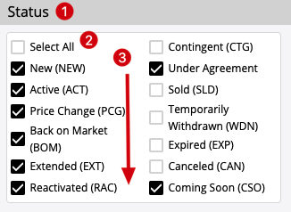

TypeScript React Multi-Check Program
============================================

## Notice:

This is a simplified component from real project.
When you do it, consider it as a real task, and show your best programming practices.
Your code will be reviewed and scored by the other developers of the team you will join.

Your code will have higher score if:

1. You split the task into smaller tasks, complete them one by one, and commit them in different git commits with proper commit messages 
1. The code is clean and easy to read and understand
1. The variable and function names are considered carefully
1. Small and meaningful functions for complex logic
1. No typo and has good code format
1. Provide proper/valuable comments, but only when it's necessary (in code and/or in github PR1. Try improving the code to avoid un-necessary comment1. 

## Task

Implement a react function component with typescript.

1. typescript + react
1. provide proper comments in code (and only when it's necessary) 
1. show your best practice
1. use github pull request to submit your code

Find `TODO` in code to implement, you can also change any code in codebase to make it better.

## Component Requirement:



1. The component has a label
1. The special `Select All` option
   1. if checked, all other options are checked
   1. if unchecked, all other options are unchecked
   1. if all other options are checked, it should be checked
   1. if any other option are unchecked, it should be unchecked
1. The options support multiple-columns, and the direction is from top to bottom

### Performance requirement

You can add proper react hooks in the component to avoid unnecessary executions or renders.

## Dev

```
yarn install
yarn dev
```

Notice:
1. Please use html native checkbox (`<input type="checkbox" />`) as the base,
   the style doesn't need to be exactly the same
1. Please follow the best Typescript style and best practices
